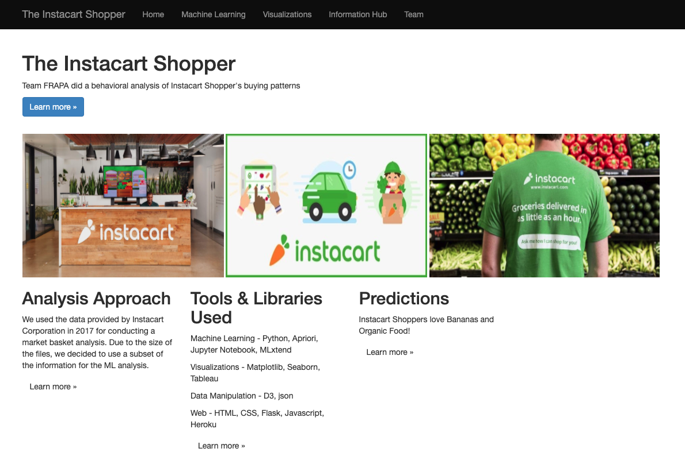
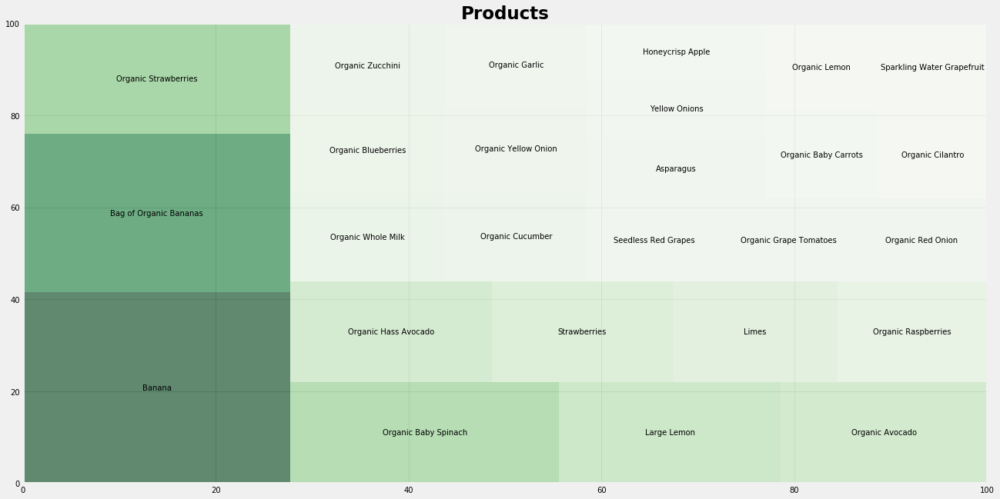
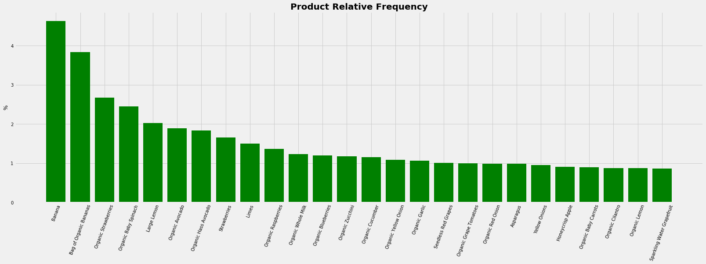
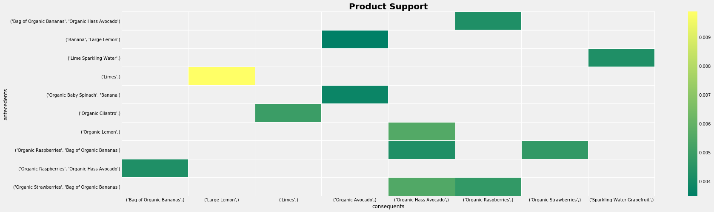
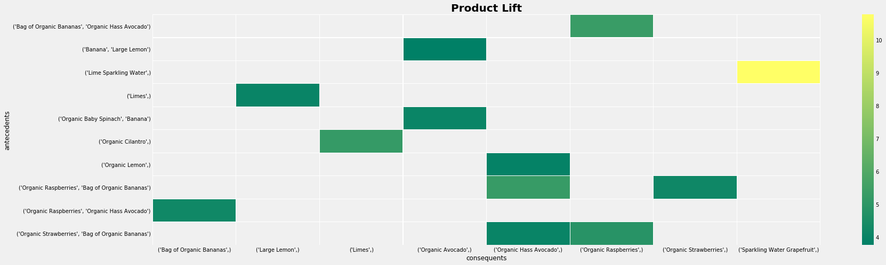
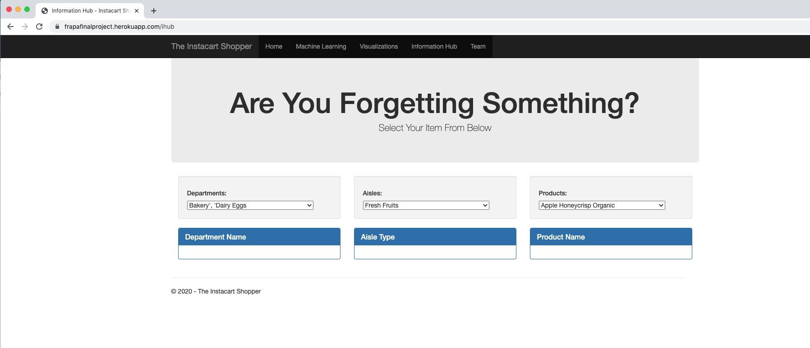

# Instacart Shopper 

> ### What are Instacart's most frequntly bought item sets?

## Purpose
___

The aim of the project was to use machine learning to learn of Instacart’s customers preferences by analyzing the most frequently bought item sets.

To mine the frequent item sets and devise association rules from Kaggle’s Instacart dataset, we decided to use a machine learning algorithm called apriori (used Python mlxtend library to import apriori, and association rules).

## Tools Used
---

Machine Learning - Python (Mlxtend Library to import Apriori and Association Rules).

Visualizations - Tableau, Matlplotlib, Seaborn, Networkx

Data Manipulation - D3.js, JSON

Web - HTML, CSS, Flask, JavaScript, Heroku

## Data Source
---
We used Kaggle.com -- Instacart’s 2017 Online Grocery Shopping Dataset for our analysis: [Instacart Market Basket Analysis](https://www.kaggle.com/c/instacart-market-basket-analysis/data)

## Findings
___

> ### Instacart Shoppers love Bananas and Organic Food!

<table>
  <tr>
    <td>Product Frequency</td>
     <td>Relative Frequency</td>
  </tr>
  <tr>
    <td valign="top"></td>
    <td valign="top"></td>
  </tr>
 </table>

> ### Graph of 10 Product Rules (group of items frequently bought together) 

Once we fed our model with a relative frequency rate, and provided it with the basket transaction data. It created for us rules (or the combination of item sets) that had a higher value of support than the minimum threshold we provided. 

> ### Heatmaps of top 10 Product Rules

We further filtered the rules by choosing those with higher confidence levels and ordering the rules by their higher (descending) lift value. 

The following heatmaps help us evaluate the results of our model. It tells us the level of confidence and lift values present in each combination set or rule.

<table>
  <tr>
    <td>Product Support</td>
    <td>Product Lift</td>
    <td>Product Confidence</td>
  </tr>
  <tr>
    <td valign="top"></td>
    <td valign="top"></td>
    <td valign="top"></td>
  </tr>
 </table>

## Predictions
---
Page to display combination of item sets. For example, if customers buy cilantro they are likely to buy limes as well. 

<table>
  <tr>
    <td>Are you forgetting something?</td>
    <td>Select your Item</td>
  </tr>
  <tr>
    <td valign="top"></td>
    <td valign="top"></td>
  </tr>
 </table>

> ### Are you forgetting something?

> ### Select your Item
